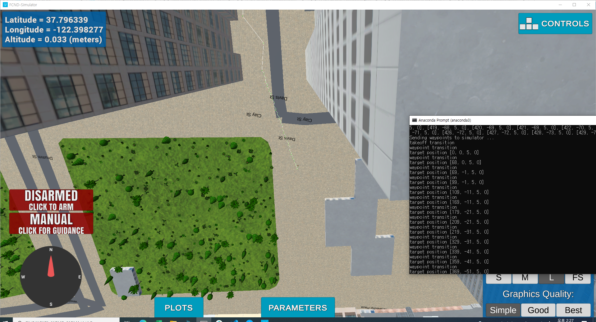

## Project: 3D Motion Planning

---

# Required Steps for a Passing Submission:
1. Load the 2.5D map in the colliders.csv file describing the environment.
2. Discretize the environment into a grid or graph representation.
3. Define the start and goal locations.
4. Perform a search using A* or other search algorithm.
5. Use a collinearity test or ray tracing method (like Bresenham) to remove unnecessary waypoints.
6. Return waypoints in local ECEF coordinates (format for `self.all_waypoints` is [N, E, altitude, heading], where the drone’s start location corresponds to [0, 0, 0, 0].
7. Write it up.
8. Congratulations!  Your Done!

## [Rubric](https://review.udacity.com/#!/rubrics/1534/view) Points
### Here I will consider the rubric points individually and describe how I addressed each point in my implementation.  

---
### Writeup / README

#### 1. Provide a Writeup / README that includes all the rubric points and how you addressed each one.  You can submit your writeup as markdown or pdf.  

You're reading it! Below I describe how I addressed each rubric point and where in my code each point is handled.

### Explain the Starter Code

#### 1. Explain the functionality of what's provided in `motion_planning.py` and `planning_utils.py`
both scripts works well. (attached fig below)  
Compare to bacyard sol, 'motion_planing.py' has a new state 'PLANNING'  
A function 'plan_path()' do following :
 - Read lat0, lon0 and set home position
 - Read obstacle map and define a grid (func 'create_grid' is used in 'planning util.py')
 - Set goal position
 - find a path (Run a * algo in 'planning util.py')
 - Prune path 
  
 1) Backyard Sol  
 
 2) motion planing starter code  
  

### Implementing Your Path Planning Algorithm

#### 1. Set your global home position

I read lat0, lon0 from the fist line of csv [line 126-130 (motion_planning.py)](motion_planning.py#L126)  
and set home position to (lat0, lon0, 0) using set_home_position() [line 132 (motion_planning.py)](motion_planning.py#L132)

#### 2. Set your current local position
I converted global position to local position using func 'global_to_local' with inputs 'global_position', 'global_home'. [line 139 (motion_planning.py)](motion_planning.py#L139)

#### 3. Set grid start position from local position
changed that to current local position [line 151 (motion_planning.py)](motion_planning.py#L151)

#### 4. Set grid goal position from geodetic coords
I added 2 input arguments '--goal_latitude', 'goal_longitude' [line 194-195 (motion_planning.py)](motion_planning.py#L194)  
and set goal as latitude , longitude position and converted [line 157-158 (motion_planning.py)](motion_planning.py#L158)

#### 5. Modify A* to include diagonal motion (or replace A* altogether)
Added diagonal actions [line 58-61 (planning_utils.py)](planning_utils.py#58) and valid actions [line 91-97 (planning_utils.py)](planning_utils.py#91)

#### 6. Cull waypoints 
I used a collinearity test method which did in prev exercise [line 159-181 (planning_utils.py)](planning_utils.py#91)

### Execute the flight
#### 1. Does it work?
It works!

 

### Double check that you've met specifications for each of the [rubric](https://review.udacity.com/#!/rubrics/1534/view) points.

